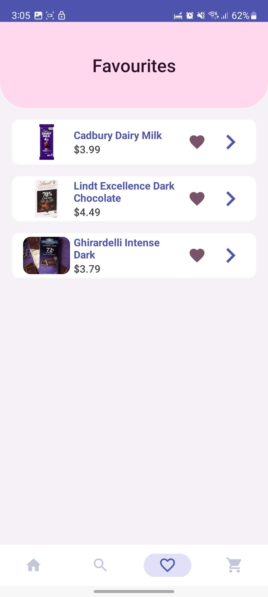

# COMPSYS 302 Project 2 Team 20

---

## 

#### Candeez is an Android Application made on Android Studio using Java. It is an application created to showcase and sell sweets or snacks. The items on Candeez were implemented using SQLite.

#### This was a University Project for COMPSYS 302 where we had to design an application to showcase a product type of our own choosing according to a set of specifications and requirements.

#### Developed by `Benson Cho` and `Josef Santos`

Initial Design Document:
https://docs.google.com/document/d/1Fg8QJMB5KvNC1VupsUTpzmRiNFF9sdRBnZac55ALOE4/edit?usp=sharing

Wireframe Prototype:  
https://www.figma.com/proto/zfG2Bn3AtoYYxg2nj4IXZv/302-Java-App-Project-2?type=design&node-id=167-243&scaling=min-zoom&page-id=167%3A243&starting-point-node-id=167%3A244

---

## Installation

To run the application, use Android Studio to emulate it or use debugging mode on your phone to run it on your Android device.

## Features

### Main Homepage

This is the main landing page of Candeez. Here you can view 13 categories of snacks and goodies. Clicking a category will take you to the ListActivity where you can browse items. You also can view the categories in grid form.

You can also see the three best-selling items and the three most viewed items on this page. If an item interests you, press the heart button to save it to your favourites list.

At the bottom is the navigation bar where you navigate to the ListActivity, FavouritesActivity, and CartActivity.

 

    
    

### Browse Items

This is the ListActivity, where you can browse through several items depending on your filters and sort through the list using the sort button. At the top is the search card, where you can search for a specific item. You may add an item to the cart and favourite an item on this page.

Clicking on any item will take you to the DetailsActivity, showing more details on the related product.

 

    
    

### Item Details

Once an item is clicked, it will take you to the DetailsActivity, which will display more product information. You may view different pictures in this view, favourite the item, or add to the cart.

Scrolling down below will show a list of related items.

 

### Favourites

Clicking on the heart icon in the navigation bar will lead you to the FavouritesActivity. Here you will see your favourited items. Clicking on the item will bring you to the details page.

 

    
    

### Cart

Clicking on the cart icon in the navigation bar will bring you to the cart activity. Here you will be able to see the items you have added to your cart and can either increase or decrease the amount of each item. Tapping on the "X" will remove the item from the cart.
 

## Animations and Transitions

    
    
    

## Technologies Used

- `Android Studio` : Used to handle compiling, designing, emulating and among many other things.
- `Java` : The language used to code the application.
- `SQLite` : Used to handle the database for Candeez
- `Python` : Used to generate the database for Candeez (Item specifications, Images).
